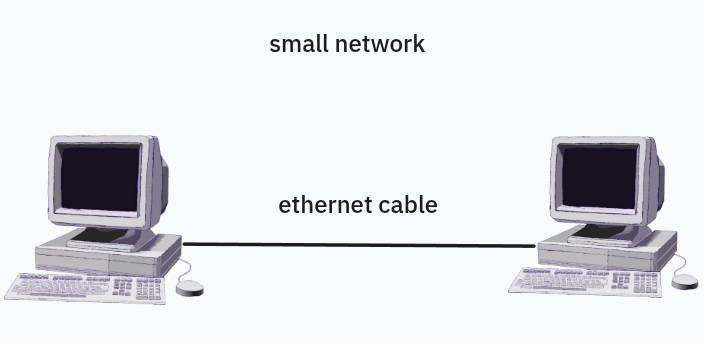
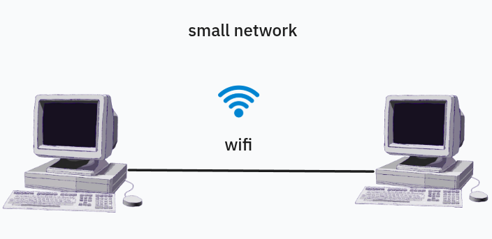

# Netpractice Project

## introduction : 
netpractice is an important project that will introduce you to the word wide of computer networking, where youo will figure out a scaled networks and identify errors that prevent the connection between networks or devices and further how the connection between two devices occur.
## content table : 
- What is a Network
- what is the osi model
- casting and its types and transmission modes
- what is an ip address
- what is a lac address
- what is the default gateway
- what is subnetting

  
what is a network :

a network is a system of interconnected devices like computers that can connect to  each other and share data , this connection allows for information exchange and access shared rousources like (printers, files , applications), networks can range from small like home or office network to  large networks like the internet .

#### how the devices connected to each other in a network :
to build a network we nedd at least two devices and medium transmission either wired or wireless .
#### small network two devices connected via wire ethernet cable.

#### small network two devices connected via wireless signal WiFi.

**how  devices  communicate  with each other :**

- networks  enable devices  to  communicate  with  each other trough protocols  which are set of rules .

**resource sharing :**

- networks  can  provide  more  beyond  communication  between  devices  also  can provide resources  sharing like  printers  , files , applications . so  if  resources  sharing  enabled  in  the  network  all  the  devices  can  access and work  with  printer , application ..

**types  of  networks :** 

- actually  there are  many  types  of  networks but  the  most common  networks  are :

**LAN** : local area network  is a network  that  connecting  the  devices  withing a house or restaurant it coves a small  area just (house, office , coffeshop).  just a limited area .

**WAN** : wide area network is a network  that connecting devices over a large distance  like internet .

**the benefits  of  networks :** 

- the  networks  provide  many  benefits  like facilitating the connection between the devices and sharing  information also enabling the access to  shared  resources  from different locations .

**wireless networks vs  wired networks :**

**wired networks :** 

- fast
- more secure
- need a stable  place .
- more reliability .

**wireless networks :**

- covers many devices
- not depend on a specific place .
- mobility .
- flexibility .
- less reliability .
- slow compare to the wired one .

 what is  the  osi model : 

the  osi (open system  interconnection)  model  is a  set  of  rules  that explains  how  the    computer  systems  communicate  over  the  network it  was  developed  by  the ISO (international standardization organization).
- the  osi model  provide a clear structure for data transmission .
- make  the  management  of  network  issues easy .

**the  layers  of  the  OSI (open system interconnection) :**

**Application Layer :**
the application  layer is  the  seventh layer it  plays  as an  interface  between  the  user end user applications  and  the  network  services because  it  provides  the  protocols  like  HTTP , FTP , SMTP  that  allow  the software to send  and receive  data . facilitating activities like  web browsing  emails an file  transfer .

**Session Layer :**
the session  layer  is  the  fifth layer  and  it is responsible for 4 core processes 
- select the transmission or (dialog) mode : (simplex , half duplex  , full duplex).
- opens the canal and sets rules for it when  it ends and when it starts .
- synchronization of  sending data (if  a connection  error occurs  it resume where it stops) .
- session management .

**Transport Lyaer :**
the application  layer is  the  seventh layer it  plays  as an  interface  between  the  user end user applications  and  the  network  services because  it  provides  the  protocols  like  HTTP , FTP , SMTP  that  allow  the software to send  and receive  data . facilitating activities like  web browsing  emails an file  transfer .

**Network Layer :**
the  network  layer is  the third layer  it  had  two  core  jobs
- the logical  addressing  : it  takes  the data  segment  that comes  from the  transport layer  and it  adds the  sender ip  and  the receiver  ip  and  it  build  the  packet  which  is  the network  unit .
- the  routing  : it  decides  the  best  path that  the  data  must go trough

**Data Link Layer :**
the data link layer  is  the second  layer  in the  osi  model  it takes  the  packet  and  adds to it  the sender’s mac address and  the  receiver’s mac address and  it  builds  the  frame  and all  that  called  the  frame  encapsulation . and  the opposite  if  the opposite  way .
- it  also  check  for  errors and  it  correct it  .

**Physical Layer :**
the  physical  layer  is  the  first  layer  of the  osi  model .
- we  said  before  that the  transport layer  creates  the packet and  the  data link layer  creates  the  frame which  is  a bunch  of zeros and  ones so  the  physical  layer  transform  the  bits  of  the  frame  into  signals that the  transmission media  will understand. so  it will be  either  electrical  signals  (Ethernet  cable) , radio signals (wireless connection) , optic  signals  (optic  transmission) .

